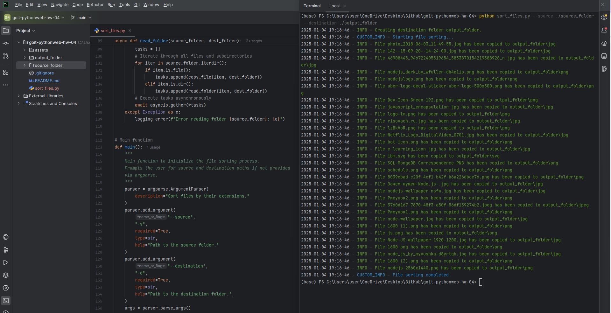
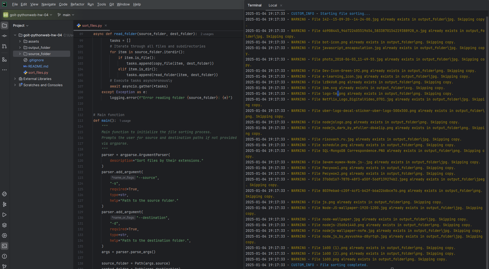

# Topic 4. Homework | Asynchronous Programming in Python

Write a Python script that reads all files from a user-specified source folder 
and distributes them into subfolders within a specified output directory based 
on their file extensions. The script should perform the sorting asynchronously 
to handle a large number of files more efficiently.

## **Task Descriptions**

---

Write a Python script that reads all files in a user-specified source folder and
distributes them into subfolders in the destination folder based on their file 
extensions. The script must perform sorting asynchronously for efficient processing of large numbers of files.

### **Step-by-Step Instructions**

1. **Import necessary asynchronous libraries.**
2. **Create an `ArgumentParser` object** to handle command-line arguments.
3. Add required arguments to specify the source and destination folders.
4. **Initialize asynchronous paths** for the source and destination folders.
5. Write an **asynchronous function `read_folder`** that recursively reads all 
files in the source folder and its subfolders.
6. Write an **asynchronous function `copy_file`** that copies each file into the
corresponding subfolder in the destination folder based on its extension.
7. Configure **error logging.**
8. Execute the `read_folder` asynchronous function in the main block.

### **Acceptance Criteria**

- Code performs asynchronous reading and copying of files.
- Files are distributed into subfolders based on their extensions.
- The program handles command-line arguments.
- All errors are logged.
- Code is readable and adheres to PEP 8 standards.

---

# TASK RESULTS

### Command to Run the Code

> [!IMPORTANT]
> 
> python sort_files.py --source ./source_folder --destination ./output_folder

